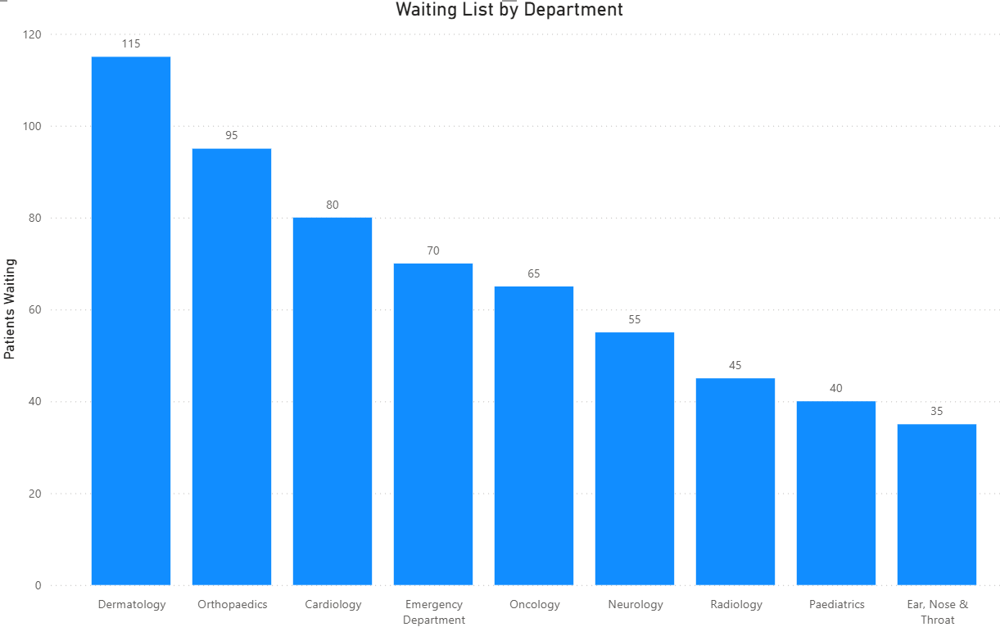

<p align="center">
  
</p>

<h1 align="center">Healthcare SQL Analytics</h1>

<p align="center">
End-to-End SQL Server & Power BI Business Intelligence Project
</p>

<p align="center">


</p>

---

# 📌 Project Overview

Healthcare SQL Analytics is an end-to-end Business Intelligence project demonstrating how **SQL Server** and **Power BI** can be used to transform raw healthcare data into meaningful operational insights.

The project simulates a healthcare organisation by designing a fully relational SQL database, generating realistic synthetic healthcare data, developing analytical SQL queries, and presenting the results through an interactive Power BI dashboard.

The primary objective is to showcase practical SQL development, database design, KPI reporting and Business Intelligence skills within a realistic healthcare scenario.

---

> ## ⚠ Disclaimer
>
> This project uses **synthetically generated healthcare data** created solely for educational and portfolio purposes.
>
> No real patient information, NHS data or confidential healthcare records are included anywhere within this repository.

---

# 🎯 Project Objectives

The project demonstrates practical skills in:

- Designing a relational SQL Server database
- Creating realistic synthetic healthcare data
- Developing reusable SQL Views
- Creating Stored Procedures
- Writing analytical KPI queries
- Performing waiting list analysis
- Building an interactive Power BI dashboard
- Producing professional technical documentation suitable for a software engineering portfolio

---

# 📊 Dashboard Preview

The Power BI dashboard provides an executive overview of healthcare operational performance.

It enables users to analyse:

- Department performance
- Consultant workload
- Monthly appointment activity
- Waiting list volumes
- Appointment outcomes
- Overall operational KPIs

<p align="center">

</p>

---

# 🗂 Database Entity Relationship Diagram (ERD)

The database follows a fully relational design with primary and foreign key relationships to maintain data integrity and support efficient reporting.

<p align="center">

</p>

### Database Entities

- Departments
- Consultants
- Patients
- Appointments
- Referrals
- Waiting List
- Appointment Outcomes

The schema was designed using database normalisation principles and reflects a simplified healthcare management system.

---

# 📈 SQL Queries Powering the Dashboard

The Power BI dashboard is driven entirely by SQL queries executed against the Healthcare SQL Analytics database.

These queries calculate operational KPIs before the results are visualised in Power BI.

---

## Department Performance KPI

<p align="center">

</p>

This query calculates:

- Total Appointments
- Completed Appointments
- Cancelled Appointments
- Did Not Attend (DNA) Appointments

The output is used within the following dashboard visuals:

- Appointments by Department
- Appointment Status Distribution

---

## Waiting List Analysis

<p align="center">

</p>

This SQL query calculates waiting list volumes across healthcare departments.

The results are visualised within the dashboard to identify departments experiencing the greatest patient demand.

---

# 💻 Technologies Used

| Technology | Purpose |
|------------|---------|
| SQL Server | Relational Database |
| SQL | Database Development & Analytics |
| SQL Server Management Studio (SSMS) | Database Management |
| Power BI Desktop | Dashboard Development |
| Git | Version Control |
| GitHub | Portfolio Hosting |

---

# 🏥 Synthetic Dataset

The entire dataset was generated programmatically using SQL scripts.

The database contains realistic synthetic healthcare information including:

- Departments
- Consultants
- Patients
- Appointments
- Referrals
- Waiting Lists
- Appointment Outcomes

This approach enables realistic Business Intelligence reporting while ensuring no confidential healthcare information is used.

---
# 📁 Project Structure

```text
Healthcare-SQL-Analytics/
│
├── docs/
│   └── screenshots/
│       ├── appointments_by_department.png
│       ├── consultant_workload.png
│       ├── healthcare_operations_dashboard.png
│       ├── healthcare_sql_analytics_erd.png
│       ├── healthcare_sql_analytics_logo.png
│       ├── monthly_appointment_trend.png
│       ├── pie_charts.png
│       ├── sql_department_kpi.png
│       ├── sql_waiting_list_kpi.png
│       └── waiting_list_by_department.png
│
├── outputs/
│   └── sample_results.md
│
├── sql/
│   ├── 01_create_database.sql
│   ├── 02_create_tables.sql
│   ├── 03_generate_synthetic_data.sql
│   ├── 04_views.sql
│   ├── 05_stored_procedures.sql
│   ├── 06_kpi_queries.sql
│   └── 07_waiting_list_analysis.sql
│
├── HealthSQL_Insights_Dashboard.pbix
├── LICENSE
├── README.md
└── .gitignore
```

The repository follows a clean, modular structure that separates SQL development, documentation, screenshots, outputs and dashboard assets, making the project easy to understand, maintain and extend.

---

# 🗄 SQL Development

The SQL solution is organised into sequential scripts so that the complete database can be recreated from scratch in just a few minutes.

| Script | Description |
|---------|-------------|
| **01_create_database.sql** | Creates the Healthcare SQL Analytics database. |
| **02_create_tables.sql** | Creates all tables, primary keys and foreign key relationships. |
| **03_generate_synthetic_data.sql** | Populates the database with realistic synthetic healthcare data. |
| **04_views.sql** | Creates reusable reporting views for simplified analysis. |
| **05_stored_procedures.sql** | Implements parameterised stored procedures for reporting and data retrieval. |
| **06_kpi_queries.sql** | Contains analytical SQL queries used to calculate operational KPIs. |
| **07_waiting_list_analysis.sql** | Performs waiting list and operational performance analysis. |

Running these scripts in sequence recreates the complete project environment.

---

# 👁 SQL Views

Views simplify reporting by combining data from multiple related tables into reusable datasets.

Examples include:

- Appointment Summary
- Department Performance
- Daily Clinic Schedule
- Clinical Outcomes

Using Views improves query readability, reduces duplication and provides a consistent reporting layer for Business Intelligence tools.

---

# ⚙ Stored Procedures

Stored Procedures demonstrate reusable SQL programming techniques through parameterised queries.

The project includes procedures for:

- Retrieving appointments by department
- Viewing consultant schedules
- Accessing patient history
- Generating department KPI summaries

These procedures simulate real-world reporting scenarios commonly found in healthcare information systems.

---

# 📈 KPI Analysis

A collection of analytical SQL queries was developed to measure healthcare operational performance.

Key metrics include:

- Total Appointments
- Appointment Completion Rate
- Cancellation Rate
- Did Not Attend (DNA) Rate
- Consultant Workload
- Monthly Appointment Trends
- Department Performance
- Waiting List Volumes

These KPIs provide meaningful operational insights and support evidence-based decision-making.

---

# 📊 Power BI Dashboard

The SQL database is connected directly to **Power BI Desktop**, where the analytical results are transformed into an interactive Business Intelligence dashboard.

The dashboard enables users to explore healthcare performance through intuitive charts, KPIs and visual summaries.

Key capabilities include:

- Department comparisons
- Consultant workload analysis
- Appointment trend analysis
- Waiting list monitoring
- Appointment status tracking
- Interactive filtering and exploration

This demonstrates how SQL-generated insights can be transformed into executive-level reports for healthcare managers and decision-makers.

---

# 📉 Dashboard Visualisations

## 👨‍⚕ Consultant Workload

<p align="center">

</p>

Displays appointment distribution across consultants, helping identify workload balance and resource utilisation.

---

## 📅 Monthly Appointment Trend

<p align="center">

</p>

Illustrates appointment activity over time, making seasonal patterns and demand fluctuations easy to identify.

---

## 🏥 Appointments by Department

<p align="center">

</p>

Compares appointment volumes across departments, highlighting areas with the highest service demand.

---

## 📌 Appointment Status Distribution

<p align="center">

</p>

Summarises appointment outcomes, including:

- Completed
- Cancelled
- Did Not Attend (DNA)

These indicators help evaluate operational efficiency and patient engagement.

---

## ⏳ Waiting List by Department

<p align="center">

</p>

Highlights departments with the largest waiting lists, supporting capacity planning and resource allocation.

---

# 🚀 Skills Demonstrated

This project demonstrates practical experience in:

### Database Development

- Relational Database Design
- Data Modelling
- Database Normalisation
- Primary & Foreign Keys
- Constraints

### SQL

- Complex Joins
- Aggregate Functions
- Window Functions
- Common Table Expressions (CTEs)
- SQL Views
- Stored Procedures
- KPI Development
- Performance Reporting

### Business Intelligence

- Power BI
- Dashboard Development
- Data Visualisation
- Healthcare Analytics
- Operational Reporting

### Professional Skills

- Technical Documentation
- Git Version Control
- GitHub
- Problem Solving
- Analytical Thinking
- Attention to Detail

---

# ▶ Running the Project

To recreate the project locally:

1. Clone this repository.

2. Open **SQL Server Management Studio (SSMS)**.

3. Execute the SQL scripts in the following order:

```text
01_create_database.sql
02_create_tables.sql
03_generate_synthetic_data.sql
04_views.sql
05_stored_procedures.sql
06_kpi_queries.sql
07_waiting_list_analysis.sql
```

4. Open **HealthSQL_Insights_Dashboard.pbix** using Power BI Desktop.

5. Refresh the data source if required.

6. Explore the interactive dashboard and analytical reports.

---
# 🌟 Why This Project Matters

Healthcare organisations generate vast amounts of operational data every day. Transforming this data into meaningful insights is essential for improving patient care, resource allocation and service efficiency.

This project demonstrates how SQL Server and Power BI can be combined to build a practical Business Intelligence solution that supports data-driven decision-making.

Using realistic synthetic healthcare data, the project showcases techniques that are commonly applied across industries, including:

- Database design
- SQL development
- KPI reporting
- Business Intelligence
- Data visualisation
- Operational analytics

Although the dataset is synthetic, the overall architecture and analytical approach closely resemble real-world reporting solutions.

---

# 🎓 Key Learning Outcomes

Throughout this project I developed practical experience in:

- Designing a fully relational SQL Server database
- Applying database normalisation principles
- Creating realistic synthetic datasets
- Writing complex SQL queries
- Developing reusable SQL Views and Stored Procedures
- Building KPI-driven reports
- Designing interactive Power BI dashboards
- Translating raw data into actionable business insights
- Structuring and documenting a professional GitHub repository

The project strengthened both my technical SQL skills and my ability to communicate analytical findings through clear, effective visualisations.

---

# 🚀 Future Improvements

Potential future enhancements include:

- Implementing SQL indexing to optimise query performance
- Adding SQL triggers for automated auditing
- Expanding stored procedures for more advanced reporting
- Creating additional executive dashboards in Power BI
- Introducing ETL pipelines for automated data ingestion
- Connecting to Azure SQL Database
- Publishing reports using Power BI Service
- Implementing Row-Level Security (RLS)
- Integrating predictive analytics using Python and Machine Learning

These enhancements would further demonstrate enterprise-level Business Intelligence and Data Engineering capabilities.

---

# 📚 Key Features

- ✅ Fully relational SQL Server database
- ✅ Synthetic healthcare dataset
- ✅ Seven modular SQL scripts
- ✅ SQL Views
- ✅ Stored Procedures
- ✅ KPI-driven analytics
- ✅ Waiting list analysis
- ✅ Interactive Power BI dashboard
- ✅ Professional project documentation
- ✅ Recruiter-friendly GitHub repository

---

# 💼 About the Author

## Sezay Rashid

**BSc (Hons) Computing Graduate**

Aspiring **Data Analyst | Business Intelligence Analyst | Data Engineer**

I enjoy designing data-driven solutions that transform complex datasets into meaningful business insights. My interests include SQL, Power BI, Python, Business Intelligence, Data Analytics and Data Engineering.

This repository forms part of my professional portfolio as I continue developing projects that demonstrate practical analytical and problem-solving skills.

---

# 📬 Connect With Me

- 📧 Email: [sezay.rashid.dev@gmail.com](mailto:sezay.rashid.dev@gmail.com)
- 💼 LinkedIn: https://www.linkedin.com/in/sezay-rashid-dev/
- 💻 GitHub: https://github.com/sezay-rashid

Feel free to connect, provide feedback or discuss opportunities related to Data Analytics, Business Intelligence or Data Engineering.

---

# 📄 License

This project is licensed under the **MIT License**.

You are free to use, modify and distribute this project in accordance with the terms of the licence.

See the **LICENSE** file for full details.

---

# 🤝 Contributions

Although this project is primarily intended as a personal portfolio piece, constructive feedback and suggestions are always welcome.

If you have ideas for improvements, feel free to open an Issue or submit a Pull Request.

---

# ⭐ Support

If you found this project useful or interesting, please consider giving the repository a ⭐ on GitHub.

Your support helps increase the visibility of the project and is greatly appreciated.

---

<p align="center">

### Thank you for visiting this repository!

**Built with SQL Server, Power BI and a passion for transforming data into meaningful insights.**

</p>
