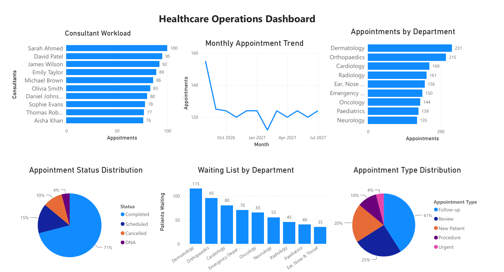
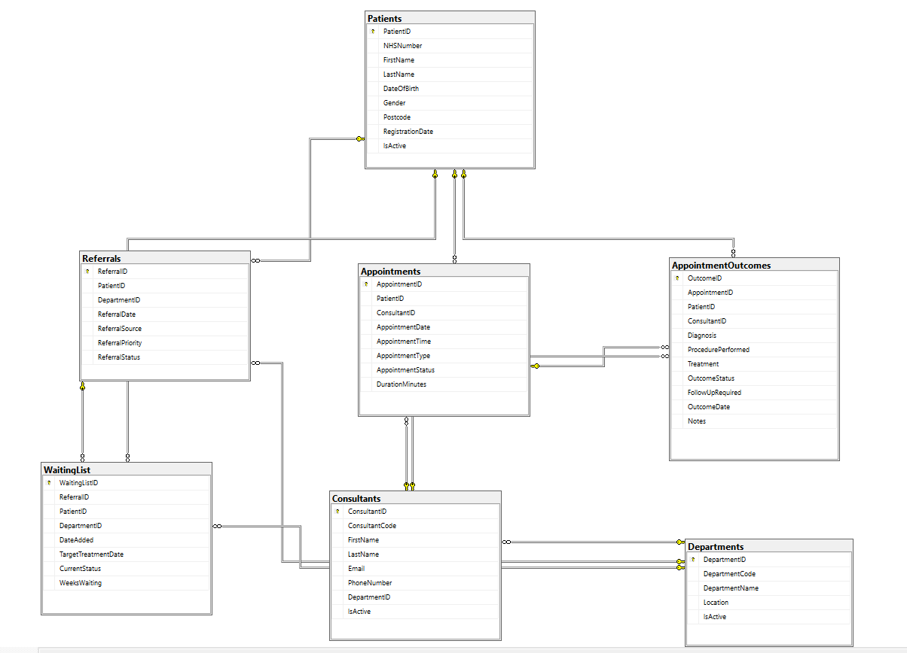
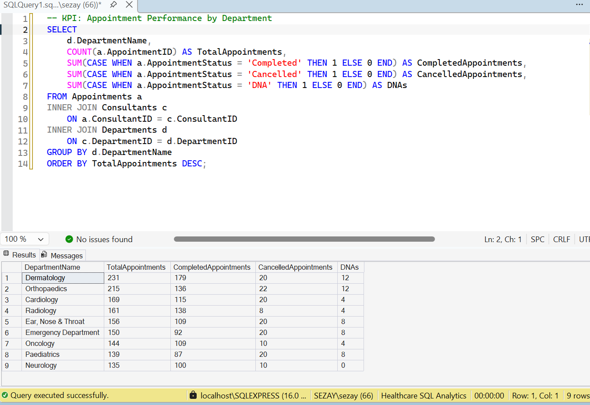
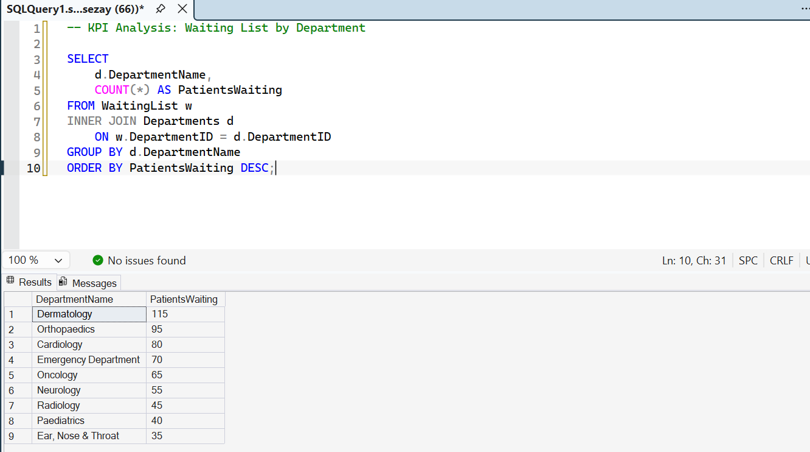
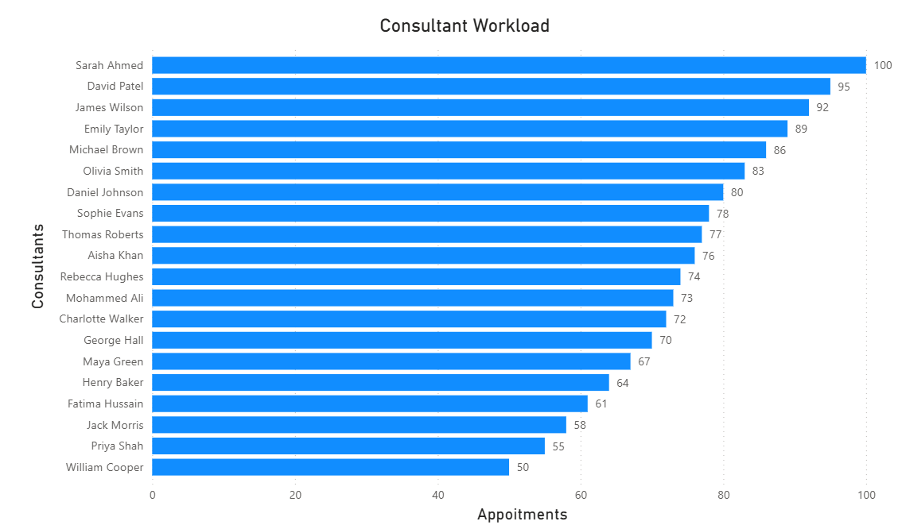
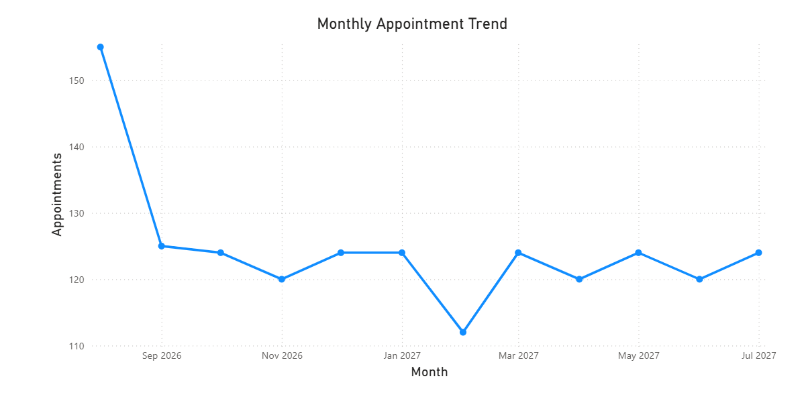
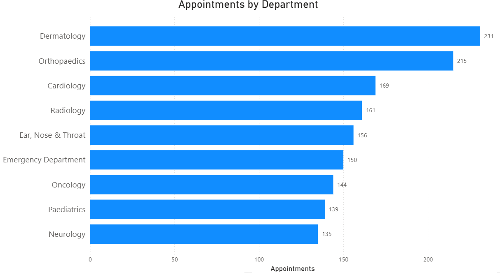
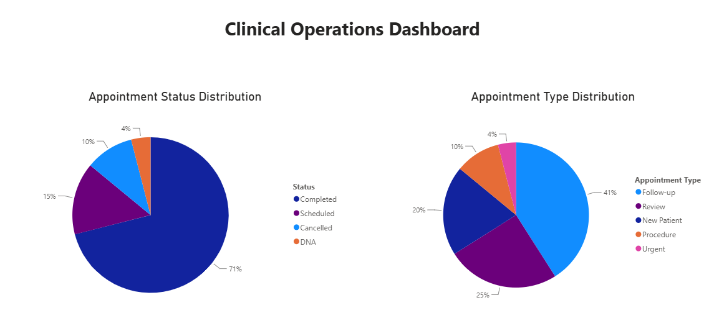

<p align="center">
  
</p>

<h1 align="center">Healthcare SQL Analytics</h1>

<p align="center">
SQL Server • Power BI • Healthcare Analytics • Business Intelligence
</p>

<p align="center">


</p>

---

# 📌 Project Overview

Healthcare SQL Analytics is an end-to-end Business Intelligence project that demonstrates how SQL Server and Power BI can be used to analyse healthcare operational data and generate meaningful business insights.

The project simulates a healthcare organisation by generating a synthetic relational database containing departments, consultants, patients, appointments, referrals, waiting lists and appointment outcomes.

Using SQL, the data is transformed into operational KPIs before being visualised in an interactive Power BI dashboard. The project demonstrates practical skills in database design, SQL development, healthcare analytics and business intelligence reporting.

---

> **Disclaimer**
>
> This project uses **synthetically generated healthcare data** created solely for educational and portfolio purposes.
>
> No real patient information, NHS data or confidential healthcare records are included anywhere in this repository.

---

# 🎯 Project Objectives

The project was designed to demonstrate practical SQL and Business Intelligence skills by:

- Designing a relational healthcare database
- Creating realistic synthetic healthcare data
- Developing SQL Views for reporting
- Building reusable Stored Procedures
- Writing KPI-focused analytical SQL queries
- Analysing waiting list performance
- Creating an interactive Power BI dashboard
- Producing recruiter-friendly documentation suitable for a professional portfolio

---

# 📊 Dashboard Preview

The interactive Power BI dashboard provides a high-level overview of healthcare operational performance.

It allows users to analyse:

- Department activity
- Consultant workload
- Appointment trends
- Waiting lists
- Appointment outcomes
- Patient activity

<p align="center">

</p>

---

# 🗂 Database Entity Relationship Diagram (ERD)

The database was designed using a relational structure with foreign key relationships to ensure referential integrity and support efficient reporting.

<p align="center">

</p>

The schema includes the following core entities:

- Departments
- Consultants
- Patients
- Appointments
- Referrals
- Waiting List
- Appointment Outcomes

This structure enables realistic healthcare reporting while maintaining a fully normalised database design.

---

# 📈 SQL Queries Powering the Dashboard

The Power BI dashboard is driven directly from SQL queries executed against the Healthcare SQL Analytics database.

These queries calculate operational KPIs before the results are visualised in Power BI.

---

## Department Performance KPI

<p align="center">

</p>

This KPI query calculates:

- Total appointments
- Completed appointments
- Cancelled appointments
- Did Not Attend (DNA) appointments

The output is used to power:

- Appointments by Department
- Appointment Status Distribution

---

## Waiting List Analysis

<p align="center">

</p>

This SQL query analyses waiting list volumes across hospital departments.

The results are visualised in the Power BI dashboard, allowing departments with the highest patient demand to be identified quickly.

---

# 💻 Technologies Used

| Technology | Purpose |
|------------|---------|
| SQL Server | Relational database |
| SQL | Database development and analytics |
| SQL Server Management Studio (SSMS) | Database management |
| Power BI Desktop | Interactive dashboard development |
| Git | Version control |
| GitHub | Project hosting and portfolio |

---

# 🏥 Synthetic Dataset

The database was generated entirely using SQL scripts.

The project contains realistic synthetic healthcare data including:

- Departments
- Consultants
- Patients
- Appointments
- Referrals
- Waiting Lists
- Appointment Outcomes

The synthetic dataset allows realistic business intelligence reporting without exposing any confidential healthcare information.

---

# 📁 Project Structure

```text
Healthcare-SQL-Analytics/
│
├── docs/
│   └── screenshots/
│       ├── appointments_by_department.png
│       ├── consultant_workload.png
│       ├── healthcare_operations_dashboard.png
│       ├── healthcare_sql_analytics_erd.png
│       ├── healthcare_sql_analytics_logo.png
│       ├── monthly_appointment_trend.png
│       ├── pie_charts.png
│       ├── sql_department_kpi.png
│       └── sql_waiting_list_kpi.png
│
├── outputs/
│
├── sql/
│   ├── 01_create_database.sql
│   ├── 02_create_tables.sql
│   ├── 03_generate_synthetic_data.sql
│   ├── 04_views.sql
│   ├── 05_stored_procedures.sql
│   ├── 06_kpi_queries.sql
│   └── 07_waiting_list_analysis.sql
│
├── HealthSQL_Insights_Dashboard.pbix
├── LICENSE
├── README.md
└── .gitignore
```

The repository is organised to reflect a typical Business Intelligence workflow, separating SQL development, documentation, dashboard assets and project outputs into clearly structured folders.

---

# 🗄 SQL Development

The SQL solution is divided into several scripts, allowing the database to be recreated from scratch in a logical sequence.

| Script | Description |
|---------|-------------|
| **01_create_database.sql** | Creates the Healthcare SQL Analytics database |
| **02_create_tables.sql** | Creates all relational tables, primary keys and foreign keys |
| **03_generate_synthetic_data.sql** | Populates the database with realistic synthetic healthcare data |
| **04_views.sql** | Creates reusable reporting views |
| **05_stored_procedures.sql** | Creates parameterised stored procedures for reporting |
| **06_kpi_queries.sql** | Contains analytical KPI queries used for reporting |
| **07_waiting_list_analysis.sql** | Performs waiting list and operational performance analysis |

---

# 📊 SQL Views

Views simplify reporting by combining information from multiple tables into reusable datasets.

Examples include:

- Appointment summaries
- Department performance
- Consultant schedules
- Clinical outcomes

Using Views improves readability, reduces duplicate SQL code and provides a consistent reporting layer for Business Intelligence tools.

---

# ⚙ Stored Procedures

Stored Procedures demonstrate reusable SQL programming techniques and parameterised reporting.

Examples include:

- Retrieve appointments by department
- Consultant schedules
- Patient history
- Department KPI summaries

These procedures illustrate how SQL can support operational reporting while improving maintainability and performance.

---

# 📈 KPI Analysis

A series of analytical SQL queries were developed to measure operational healthcare performance.

The KPIs include:

- Total appointments
- Appointment completion rate
- Cancellation rate
- Did Not Attend (DNA) rate
- Consultant workload
- Monthly appointment trends
- Waiting list volumes
- Department performance

These metrics closely resemble those used within healthcare organisations to monitor operational efficiency.

---

# 📊 Power BI Dashboard

The SQL database is connected directly to Power BI Desktop, where the analytical queries are transformed into interactive visualisations.

The dashboard enables users to explore healthcare performance quickly through intuitive charts and KPI summaries.

Key features include:

- Interactive filtering
- Department comparisons
- Consultant workload analysis
- Waiting list monitoring
- Appointment status tracking
- Monthly operational trends

The dashboard demonstrates how SQL-generated insights can be transformed into executive-level reports for decision-makers.

---

# 📉 Dashboard Visuals

## Consultant Workload

<p align="center">

</p>

Displays the distribution of appointments across consultants, helping identify workload balance and resource utilisation.

---

## Monthly Appointment Trend

<p align="center">

</p>

Illustrates appointment activity over time, allowing seasonal patterns and demand fluctuations to be identified.

---

## Appointments by Department

<p align="center">

</p>

Compares appointment volumes across healthcare departments, providing insight into service demand.

---

## Appointment Status Distribution

<p align="center">

</p>

Visualises appointment outcomes, including:

- Completed
- Cancelled
- Did Not Attend (DNA)

These metrics support operational monitoring and service improvement initiatives.

---

## Waiting List by Department

This visual forms part of the main dashboard and highlights departments with the greatest patient demand.

Monitoring waiting list sizes helps identify capacity pressures and supports service planning.

---

# 🚀 Skills Demonstrated

This project demonstrates practical experience in:

- Relational Database Design
- SQL Development
- Data Modelling
- Primary & Foreign Keys
- SQL Views
- Stored Procedures
- Aggregate Functions
- Joins
- Window Functions
- Common Table Expressions (CTEs)
- KPI Development
- Healthcare Data Analysis
- Business Intelligence
- Power BI Dashboard Development
- Data Visualisation
- Git Version Control
- GitHub Documentation
- Technical Documentation
- Problem Solving
- Analytical Thinking

---

# ▶️ Running the Project

To recreate the project locally:

1. Clone this repository.
2. Open SQL Server Management Studio (SSMS).
3. Execute the SQL scripts in numerical order:

```text
01_create_database.sql
02_create_tables.sql
03_generate_synthetic_data.sql
04_views.sql
05_stored_procedures.sql
06_kpi_queries.sql
07_waiting_list_analysis.sql
```

4. Open **HealthSQL_Insights_Dashboard.pbix** using Power BI Desktop.
5. Refresh the data source if required.
6. Explore the interactive dashboard and analytical reports.

---

# 🔮 Future Improvements

This project provides a strong foundation for healthcare analytics and Business Intelligence. Future enhancements could include:

- Implementing SQL indexes to optimise query performance
- Creating SQL triggers for automated auditing
- Developing advanced stored procedures for operational reporting
- Building additional Power BI dashboards for executive and clinical reporting
- Integrating live healthcare datasets through ETL pipelines
- Implementing row-level security within Power BI
- Creating KPI scorecards for healthcare management
- Adding predictive analytics and machine learning models to forecast appointment demand and waiting list growth
- Deploying the solution to Microsoft Azure SQL Database and Power BI Service

These enhancements would further demonstrate enterprise-level data engineering and analytics capabilities.

---

# 🎓 Key Learning Outcomes

Through this project, I gained practical experience in:

- Designing and implementing relational databases
- Developing efficient SQL queries for business reporting
- Creating reusable Views and Stored Procedures
- Generating and analysing healthcare KPIs
- Applying database normalisation principles
- Designing meaningful Business Intelligence dashboards
- Transforming raw data into actionable insights
- Structuring a professional GitHub repository
- Documenting technical projects for employers and recruiters

This project strengthened both my technical SQL skills and my ability to communicate analytical findings through effective visualisation.

---

# 💼 Why This Project Matters

Healthcare organisations rely heavily on accurate operational data to support decision-making.

This project demonstrates how SQL Server and Power BI can be combined to:

- Monitor operational performance
- Measure service efficiency
- Identify capacity pressures
- Analyse consultant workload
- Monitor appointment outcomes
- Track waiting list activity
- Support evidence-based decision-making

Although the dataset is synthetic, the reporting techniques and analytical approach closely reflect real-world Business Intelligence solutions used across healthcare organisations.

---

# 📌 Repository Highlights

✔ End-to-end SQL Server project

✔ Fully relational database design

✔ Synthetic healthcare dataset

✔ SQL Views

✔ Stored Procedures

✔ KPI-driven analytics

✔ Waiting list analysis

✔ Interactive Power BI dashboard

✔ Professional project documentation

✔ Portfolio-ready GitHub repository

---

# 👨‍💻 Author

**Sezay Rashid**

Graduate BSc (Hons) Computing

Aspiring Data Analyst | Business Intelligence Analyst | Data Engineer

### Connect with me

- Email: *(sezay.rashid.dev@gmail.com)*
- LinkedIn: *(www.linkedin.com/in/sezay-rashid-dev)*
- GitHub: *(https://github.com/sezay-rashid/sezay-rashid)*

I am passionate about transforming data into meaningful insights and continuously developing my skills in SQL, Business Intelligence, Data Analytics and Data Engineering.

---

# 📄 License

This project is licensed under the **MIT License**.

You are welcome to use, modify and distribute this project in accordance with the terms of the license.

See the **LICENSE** file for more information.

---

# ⭐ Support

If you found this project useful or interesting, consider giving the repository a ⭐ on GitHub.

Feedback, suggestions and contributions are always welcome.

---

<p align="center">

**Thank you for visiting this repository.**

Built with SQL Server, Power BI and a passion for data.

</p>
